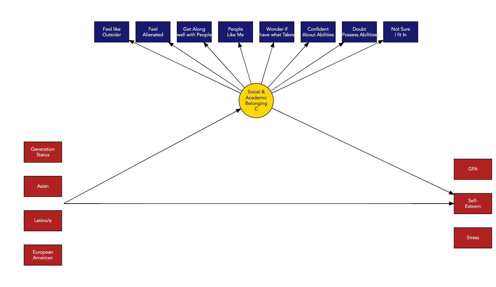

# A Tale of Two Belongings  
*Mapping the Dual Landscape of Student Belonging with Latent Class Analysis*

**Author**: Delwin Carter  
**Date**: June 21, 2025  

---

## 🧭 Summary

This study applies **Latent Class Analysis (LCA)** to identify *four distinct profiles* of university student belonging using **polytomous survey responses** from 837 students. We explore how **social** and **academic belonging** cluster differently across students — and how these profiles predict GPA, self-esteem, and stress.

> 🎓 *What happens when students feel they belong socially, but not academically? Or vice versa?*  
> This project unpacks that question with statistical precision.

---

## 🔍 Key Findings

- **Four profiles** emerged:  
  1. High Social, High Academic  
  2. Low Social, High Academic  
  3. High Social, Low Academic  
  4. Low Social, Low Academic  

- **Academic belonging** was the strongest predictor of GPA and self-esteem.  
- **Joint absence** of both belonging types linked to higher stress and lower outcomes.  
- **LCA with polytomous data** offers a powerful tool for developing targeted campus interventions.

---

## 📁 Project Structure

```text
Belonging.qmd               # Main Quarto document (R + Markdown)
A Tale of Two Belongings.pdf# Full compiled report
figures/                    # Auto-generated figures and diagrams
data/                       # SPSS dataset
Belonging_files/            # Supporting Quarto files
functions/, enum/, enum2/, 3step/  # Submodules for analyses
```

---

## 📊 Methodology: Visual Overview

The model uses categorical indicators for both **social** and **academic belonging**, with latent profiles predicting distal outcomes:

  
*Figure: Directed graph of the LCA model structure.*

---

## 📦 Dependencies

To reproduce the analysis, install the required R packages:

```r
install.packages(c(
  "tidyverse", "haven", "glue", "MplusAutomation", "here",
  "janitor", "gt", "cowplot", "DiagrammeR", "webshot2",
  "stringr", "flextable", "officer", "dplyr", "tidyr"
))
```

All code is written in `R` using [Quarto](https://quarto.org/). Analysis assumes a working [Mplus](https://www.statmodel.com/) installation for model estimation.

---

## 📚 Source

Smaranda Ioana Lawrie¹*†, Delwin B. Carter²†,  
Karen Nylund-Gibson², and Heejung S. Kim³⁴*  
(2025). *A Tale of Two Belongings: Exploring Social and Academic Belonging in University Students.* University of California, Santa Barbara.  
† These authors contributed equally.

---

## 🔑 Keywords

`Latent Class Analysis` • `Belonging` • `Social Belonging` • `Academic Belonging` • `Student Well-Being` • `Polytomous Data` • `GPA` • `Self-Esteem` • `Stress` • `Mplus` • `R Quarto` • `Higher Education`

---

## 📎 Links

- 🔬 [View full PDF report](./lawrie%20et%20al%20(2024).pdf)  
- 📈 [figures/](./figures) — explore visualizations

---

## 🙋‍♀️ Questions?

For questions, please contact [@delwincarter](https://github.com/delwincarter).
